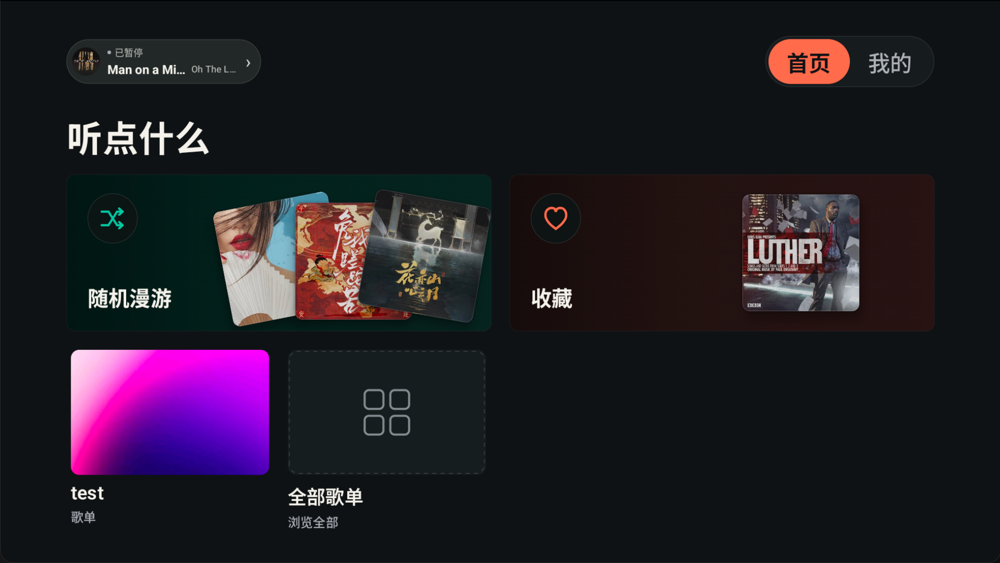
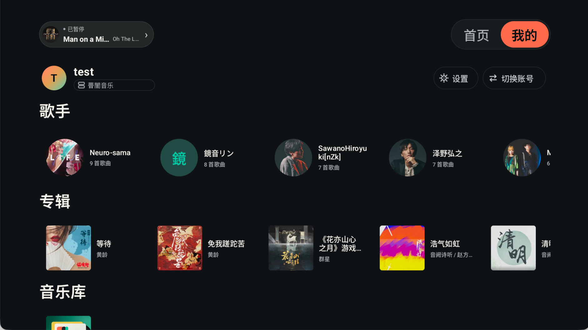
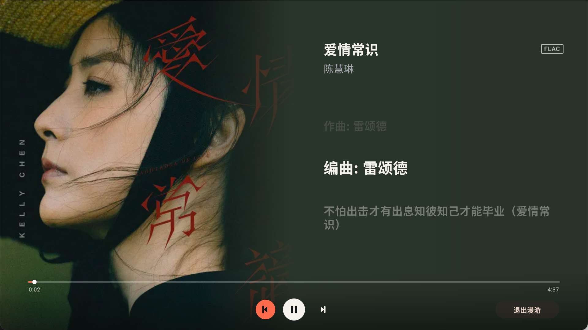
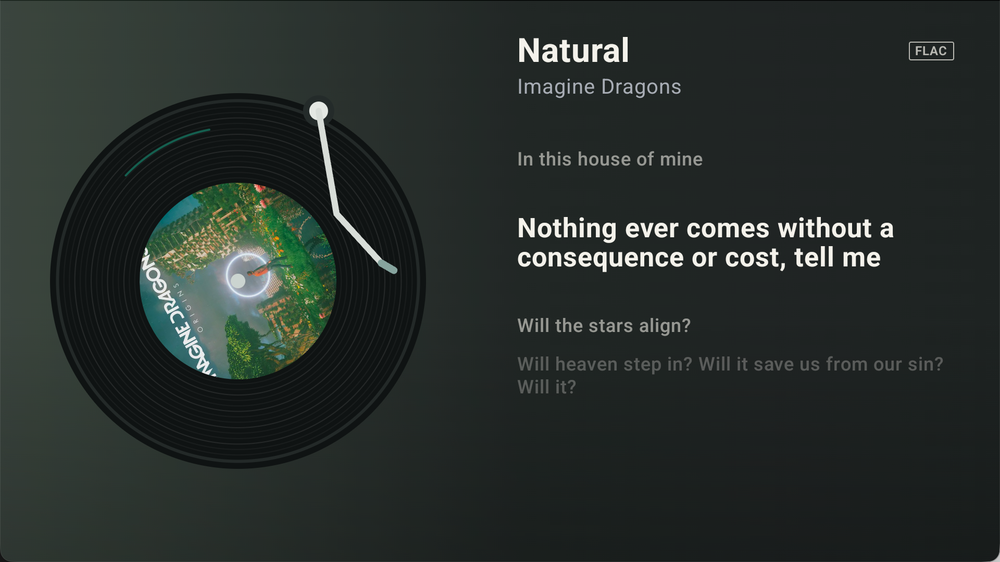

<p align="center">
  
</p>

<h1 align="center">回声台</h1>

<p align="center">面向 Android TV 与 Android 投影设备，也可侧载至普通安卓车机的飞牛音乐第三方客户端</p>

项目使用 Kotlin、Compose for TV 与 Media3 构建，针对电视大屏、横屏布局、遥控器和
触屏操作进行了适配。

> 本项目为第三方客户端，与飞牛官方无关。使用前请确保已经部署可访问的飞牛音乐服务，
> 并遵守相关服务条款。

## 主要功能

- **电视端原生体验**：适配 Android TV 启动器、横屏显示与 D-pad 遥控器焦点操作。
- **触屏操作**：支持点击导航、卡片和播放控件，也可直接滑动首页、音乐库、列表与设置页面。
- **音乐库浏览**：支持歌单、歌手、专辑和全部歌曲浏览，可进入详情页播放完整列表。
- **随机漫游**：从音乐库持续发现歌曲，并支持上一首、下一首和退出漫游。
- **完整播放队列**：支持列表循环、随机播放、单曲循环与顺序播放。
- **沉浸式播放器**：提供 CD 模式和大海报模式，可在设置中随时切换。
- **歌词显示**：默认在线匹配高置信度的原文与译文，命中结果会缓存；匹配不到或在线源异常时自动使用飞牛歌词，也可在设置中关闭在线匹配。
- **灵活连接 NAS**：支持 HTTP、HTTPS、FNID 自动选路、访问码验证、断网恢复和多服务器、多账号登录历史。
- **本地缓存**：缓存封面与音乐库资料，可设置图片缓存上限并手动清理。

## 界面预览

| 首页 | 我的音乐 |
| --- | --- |
|  |  |

| 歌手歌曲 | 歌手歌专辑 |
| --- | --- |
|  |  |

| 播放控制 | CD 播放器 |
| --- | --- |
|  |  |

<p align="center"><strong>大海报播放器</strong></p>
<p align="center">
  
</p>

## 爱发电

<a href="https://afdian.com/a/qiaoke" target="_blank">
  
</a>

如果这个项目对你有所帮助，欢迎留下 Star 或通过爱发电支持项目。您的每一份认可，都会成为我持续完善体验的动力。

## 安装

### 下载预编译版本

前往 [Releases](https://github.com/QiaoKes/fn-music-tv/releases) 下载最新版通用 APK：

```text
fn-music-tv-<version>-universal.apk
```

通用包包含 `arm64-v8a`、`armeabi-v7a`、`x86` 与 `x86_64`，支持 Android 6.0 及以上
系统。下载后可通过 U 盘、文件管理器或 ADB 安装：

```sh
adb install fn-music-tv-<version>-universal.apk
```

若系统拦截安装，请在设备设置中允许当前文件管理器或安装工具“安装未知应用”。

### 首次登录

登录页中的“NAS 地址或 FNID”支持以下填写方式：

| 连接方式 | 填写示例 | HTTPS 开关 |
| --- | --- | --- |
| 局域网 HTTP | `192.168.1.10:5666` | 关闭 |
| HTTPS 域名 | `nas.example.com` | 打开 |
| 完整 URL | `http://nas.example.com:5666` 或 `https://nas.example.com` | 会根据 URL 自动切换 |
| FNID | `yourfnid` | 无需设置，应用会自动探测直连与中继 |

1. 填写 NAS 地址、域名或 FNID。使用自定义端口时，请把端口一并写入地址。
2. 输入飞牛音乐账号和密码。
3. 如果飞牛 NAS 开启了外网访问码，请在“安全码”中填写该访问码；未启用时留空。
4. 需要下次自动恢复会话时，保留“保持登录”。
5. 选择“登录”，应用会验证访问码和账号，并连接到飞牛音乐服务。

开启“保持登录”后，应用会在系统安全存储中加密保存服务器、账号、密码的 SHA-256 摘要、
安全码和登录 token，不会保存明文密码。历史记录按服务器和账号区分；选择历史账号会直接
登录，行尾可删除单条记录，底部可清除全部记录。

投影仪开机时如果网络尚未就绪，应用会保留登录资料并自动重试，不需要退出应用再进入；
恢复页也可以立即重试或切换到其他账号。

直接填写 `https://` 或 `http://` 前缀时，应用会自动识别协议。仅填写域名或 IP 时，
由 HTTPS 开关决定协议。使用 FNID 时不需要勾选 HTTPS，应用会按局域网地址、外网地址和
飞牛中继的顺序探测可用连接。

访问码不是飞牛账号密码。只有 NAS 开启了访问码保护时才需要填写；如果提示“需要安全码”
或“安全码错误”，请检查飞牛 NAS 中配置的访问码。

## 遥控器与触屏操作

| 按键 | 操作 |
| --- | --- |
| 方向键 | 移动焦点、浏览列表或选择播放器控制项 |
| 确认键 | 打开页面、播放歌曲或执行当前操作 |
| 返回键 | 返回上一级；首页连续按两次退出应用 |

播放页面的控制栏会自动隐藏。按方向键或确认键可再次显示控制项；首页左上角的当前播放入口
可快速返回播放器。

触屏设备可以直接点击导航、歌曲卡片和播放器按钮，并通过横向或纵向滑动浏览内容。滑动列表时
不会误触发卡片点击；遥控器焦点与 D-pad 操作保持不变。

## 从源码构建

环境要求：

- JDK 21
- Android SDK 36
- Android SDK Platform Tools

克隆项目并构建侧载调试包：

```sh
git clone https://github.com/QiaoKes/fn-music-tv.git
cd fn-music-tv
./gradlew :app:assembleSideloadDebug
```

产物位于：

```text
app/build/outputs/apk/sideload/debug/
```

执行完整的本地质量检查：

```sh
./gradlew \
  :core:model:test \
  :core:data:testDebugUnitTest \
  :core:playback:testDebugUnitTest \
  :app:testSideloadDebugUnitTest \
  :app:lintSideloadDebug \
  :app:lintStoreDebug
```

### 本地 Release 验证构建

没有正式签名密钥时，可以显式开启本地验证模式编译 Release 包：跳过签名密钥、更新清单与
FN Connect 配置校验，改用 debug 密钥签名，可直接安装到设备做真机测试（R8 混淆等 Release
行为与正式包一致）：

```sh
./gradlew -PallowUnsignedRelease=true :app:assembleSideloadRelease
```

产物位于 `app/build/outputs/apk/sideload/release/`。注意：此类包与正式包签名不同，无法覆盖
安装正式版，FNID 登录不可用（直连 IP/域名不受影响），且不得作为正式更新分发。正式发布包
仍由 CI 使用固定签名密钥构建与发布。

## 项目结构

```text
app/            Android TV 应用、Compose 界面与应用集成
core/model/     音乐库、队列、播放模式等领域模型
core/data/      服务端 API、会话、本地数据库与缓存
core/lyrics/    在线歌词源、候选评分、歌词解析与匹配编排
core/playback/  Media3 播放服务与队列
baselineprofile/ 基准配置生成模块
```

## 兼容性说明

- 通用侧载包可安装在 Android 6.0 及以上的普通安卓车机，使用横屏触控界面运行；当前尚未在
  具体车机上实测，低分辨率屏幕、方向盘按键和车机音频策略可能因设备而异。
- 车机侧载运行不等同于 Android Auto、CarPlay 或经过车厂认证的 Android Automotive 应用；
  Android Automotive OS 是否允许安装和启动普通 APK 取决于车厂系统限制。请勿在驾驶过程中操作。
- 当前客户端不会猜测尚未通过真实 NAS 验证的 CUE/HLS 转码参数；服务端参数未确认时，
  对应歌曲会提示兼容播放暂不可用。
- 不同电视和投影设备对 Android TV feature、音频编码及后台限制的实现可能不同，目前只在vidda c3 pro 与 google 盒子上通过测试

## 特别感谢

- [Accompanist Lyrics Core](https://github.com/6xingyv/Accompanist-Lyrics) 提供 YRC、KRC 等同步歌词格式的解析与统一歌词模型。
- [Accompanist Lyrics UI](https://github.com/6xingyv/Accompanist) 提供逐字高亮、双语展示与自动滚动歌词组件。
- [LDDC](https://github.com/chenmozhijin/LDDC) 提供了多歌词源检索、匹配策略与歌词格式处理方面的实现参考。
- AndroidX、Compose for TV 与 Media3 等开源项目为本项目提供了基础能力。

## 开源许可

本项目采用 [GNU General Public License v3.0](LICENSE) 开源。你可以在 GPL-3.0 条款下
使用、修改和分发本项目；分发修改版本时也需要以 GPL-3.0 开源并提供相应源代码。
