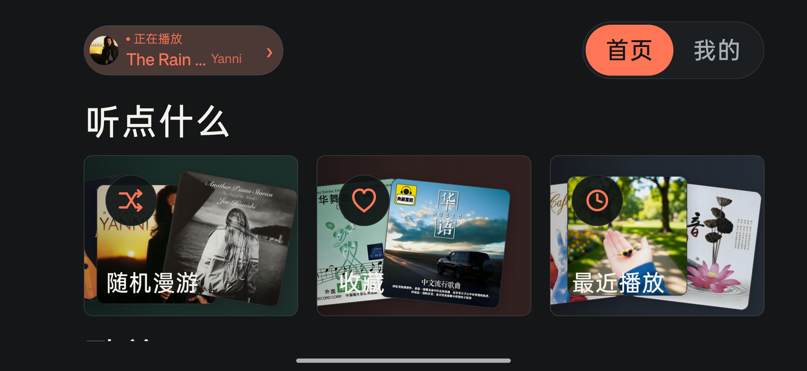
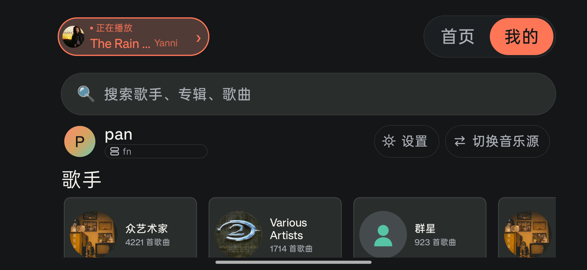
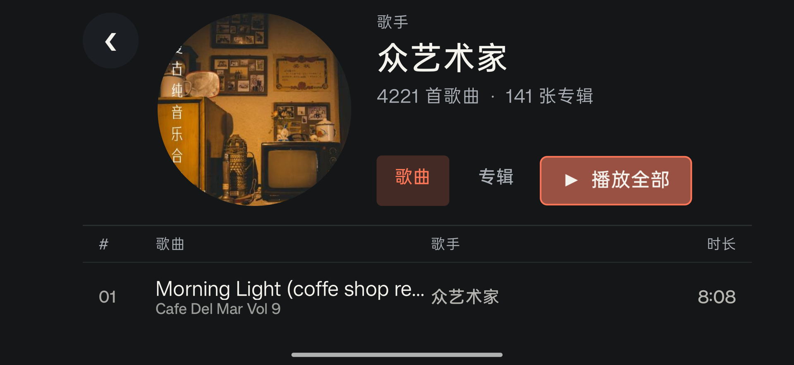
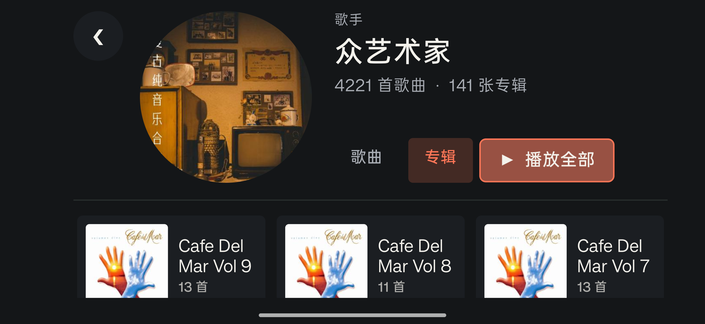
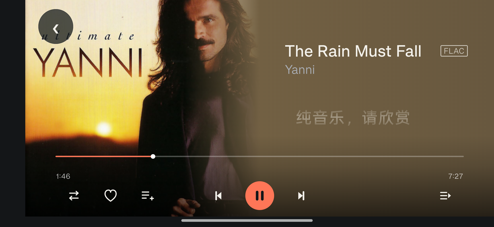
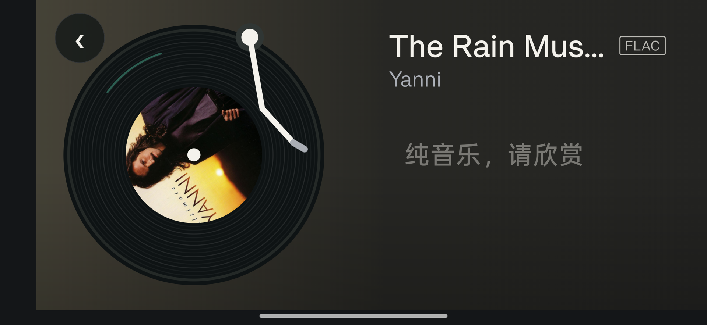
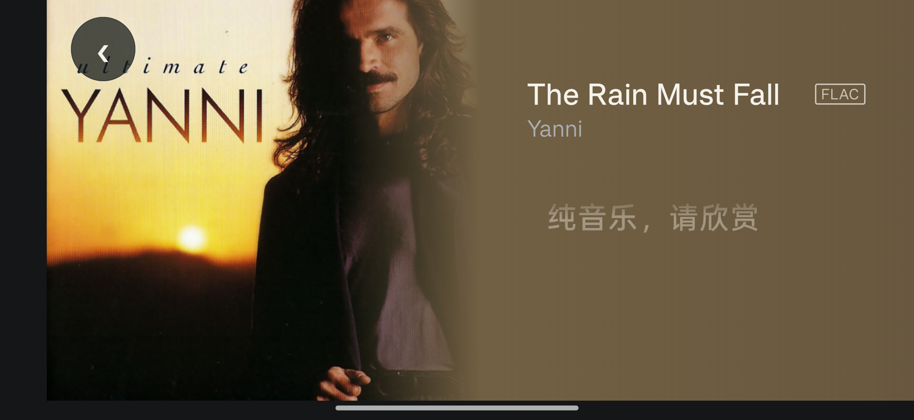

<p align="center">
  
</p>

<h1 align="center">音乐坞（MusicDock）</h1>

<p align="center">面向 Android TV 与 Android 投影设备，也可侧载至普通安卓车机的音乐客户端，
同时支持飞牛音乐（fnOS）与 Jellyfin 两种音乐服务器</p>

项目使用 Kotlin、Compose for TV 与 Media3 构建，针对电视大屏、横屏布局、遥控器和
触屏操作进行了适配。

> 本项目为第三方客户端，与飞牛官方、Jellyfin 项目均无关。使用前请确保已经部署可访问的
> 飞牛音乐服务或 Jellyfin 服务器，并遵守相关服务条款。

## 项目归属

- 本仓库是 [QiaoKes/fn-music-tv](https://github.com/QiaoKes/fn-music-tv) 的改进分支，
  原始项目与设计由 **QiaoKes（Tag mig hånden）** 完成，衷心感谢原作者的出色工作。
- 本分支由 **大南瓜** 维护，重点增强车机与触屏体验、多音乐源管理、播放容错与歌单管理能力，
  并在本仓库发布独立的编译版本。
- 上游与本分支的已知差异会随迭代变化；如需上游的原始版本，请访问原仓库。

## 主要功能

- **多音乐源**：同时保存多台服务器（飞牛音乐 / Jellyfin），随时一键切换，不用反复输密码。
  - 首次启动即添加音乐源：先选类型，再填地址与账号，连接成功即可使用。
  - 「我的」页与设置页都能进入音乐源管理：查看、**测试连通性**、切换或删除某个源。
  - 会话过期时会退回登录页，可以从中直接选一个已保存的音乐源一键重连。
- **电视端原生体验**：适配 Android TV 启动器、横屏显示与 D-pad 遥控器焦点操作。
- **触屏操作**：支持点击导航、卡片和播放控件，也可直接滑动首页、音乐库、列表与设置页面。
- **音乐库浏览**：支持歌单、歌手、专辑和全部歌曲浏览，可进入详情页播放完整列表；
  支持新建歌单、往歌单添加/移除歌曲与**删除歌单**（删除前二次确认）。
- **随机漫游**：从音乐库持续发现歌曲，并支持上一首、下一首和退出漫游
  （飞牛用服务端漫游；Jellyfin 用客户端随机漫游补齐）。
- **完整播放队列**：支持列表循环、随机播放、单曲循环与顺序播放。
- **沉浸式播放器**：提供 CD 模式和大海报模式，可在设置中随时切换；海报模式的面板色取自
  封面主导色，封面→歌词面板过渡带按色差自适应宽度并做感知插值；歌名与歌手名超宽时自动
  左右滚动。
- **歌词显示**：优先使用服务器歌词（飞牛歌词库 / Jellyfin 内嵌歌词），服务器没有时自动
  在线匹配高置信度的原文与译文（网易云、QQ 音乐、酷狗、LRCLIB **两轮检索**：快源命中即返回；
  一首都没匹配到才用更宽的预算深挖 QQ 音乐的老搜索接口），只取逐行同步歌词并缓存；也可在
  设置中关闭在线匹配。超长歌词行支持左右滚动，点击歌词行可跳转播放进度，手动滑动浏览后
  播放进度会定位到停留的歌词行。
- **灵活连接**：支持 HTTP、HTTPS、FNID 自动选路、访问码验证、断网恢复与多账号登录历史；
  Jellyfin 支持直连原文件与 HLS 转码播放（可拖动进度）。
- **本地缓存**：缓存封面与音乐库资料，可设置图片缓存上限并手动清理。

## 界面预览

| 首页 | 我的音乐 |
| --- | --- |
|  |  |

| 歌手歌曲 | 歌手专辑 |
| --- | --- |
|  |  |

| 播放控制 | CD 播放器 |
| --- | --- |
|  |  |

<p align="center"><strong>大海报播放器</strong></p>
<p align="center">
  
</p>

## 安装

### 下载预编译版本

前往 [Releases](https://github.com/pany4321/fn-music/releases) 下载最新版通用 APK：

```text
fn-music-tv-<version>-universal.apk
```

通用包包含 `arm64-v8a`、`armeabi-v7a`、`x86` 与 `x86_64`，支持 Android 6.0 及以上
系统。下载后可通过 U 盘、文件管理器或 ADB 安装：

```sh
adb install fn-music-tv-<version>-universal.apk
```

若系统拦截安装，请在设备设置中允许当前文件管理器或安装工具“安装未知应用”。

升级时直接覆盖安装即可：应用标识（`com.fnmusic.tv`）与签名保持不变，已保存的音乐源、
播放队列与缓存都会保留。

### 首次启动：添加音乐源

打开应用后是「连接音乐源」页面，按顺序：

1. **选类型**：`飞牛音乐` 或 `Jellyfin`。
2. **填地址**（下表按类型分别说明）。
3. **填账号与密码**，选择「连接」。
4. 需要下次自动恢复会话时保留「保持登录」。

**飞牛音乐（fnOS）**

| 连接方式 | 填写示例 | HTTPS 开关 |
| --- | --- | --- |
| 局域网 HTTP | `192.168.1.10:5666` | 关闭 |
| HTTPS 域名 | `nas.example.com:5667` | 打开 |
| 完整 URL | `http://nas.example.com:5666` 或 `https://nas.example.com` | 会根据 URL 自动切换 |
| FNID | `yourfnid` | 无需设置，应用会自动探测直连与中继 |

使用自定义端口时请把端口一并写入地址；开启 HTTPS 时，裸地址或 IP 默认使用 5667 端口。
证书签发域名与 IP 不一致的场景（家用 NAS 常见）App 会自动接受，域名访问仍按严格校验。
NAS 开启了外网访问码时在「安全码」中填写；未启用时留空。

**Jellyfin**

| 连接方式 | 填写示例 |
| --- | --- |
| 局域网 | `192.168.1.20:8096`（只填 IP 时自动尝试 8096/8920） |
| HTTPS 域名 | `https://jellyfin.example.com` |

账号密码使用 Jellyfin 自己的用户凭据，没有安全码/中继概念，这一栏会自动隐藏。
应用会自动识别服务器类型并回显版本号，选错类型时也会提示改过来。

添加成功后：可以在「我的」页或设置页的**音乐源**里点「测试」验证某个源是否可用
（会报告连接耗时；如果服务器可达但凭据失效，会提示重新登录）。

开启「保持登录」后，应用会在系统安全存储中加密保存服务器、账号、密码的 SHA-256 摘要、
安全码和登录 token，不会保存明文密码；Jellyfin 侧只保存访问令牌（服务端不接受哈希重放）。
历史记录按服务器与账号区分，选择某个音乐源会直接连接，行尾可删除单条记录，底部可清空全部。

投影仪开机时如果网络尚未就绪，应用会保留登录资料并自动重试，不需要退出应用再进入；
恢复页也可以立即重试或切换到其他音乐源。

## 遥控器与触屏操作

| 按键 | 操作 |
| --- | --- |
| 方向键 | 移动焦点、浏览列表或选择播放器控制项 |
| 确认键 | 打开页面、播放歌曲或执行当前操作 |
| 返回键 | 返回上一级；首页连续按两次退出应用 |

播放页面的控制栏会自动隐藏。按方向键或确认键可再次显示控制项；首页左上角的当前播放入口
可快速返回播放器。

触屏设备可以直接点击导航、歌曲卡片和播放器按钮，并通过横向或纵向滑动浏览内容。滑动列表时
不会误触发卡片点击；遥控器焦点与 D-pad 操作保持不变。

## 从源码构建

环境要求：

- JDK 21
- Android SDK 36
- Android SDK Platform Tools

克隆项目并构建侧载调试包：

```sh
git clone https://github.com/pany4321/fn-music.git
cd fn-music
./gradlew :app:assembleSideloadDebug
```

产物位于：

```text
app/build/outputs/apk/sideload/debug/
```

执行完整的本地质量检查：

```sh
./gradlew \
  :core:model:test \
  :core:data:testDebugUnitTest \
  :core:playback:testDebugUnitTest \
  :app:testSideloadDebugUnitTest \
  :app:lintSideloadDebug \
  :app:lintStoreDebug
```

正式发布由 CI 完成：`version.properties` 里 `VERSION_NAME`/`VERSION_CODE` 递增后推送到
`main`，GitHub Actions 用固定签名密钥构建通用 APK 并创建对应的 GitHub Release。

### 本地 Release 验证构建

没有正式签名密钥时，可以显式开启本地验证模式编译 Release 包：跳过签名密钥、更新清单与
FN Connect 配置校验，改用 debug 密钥签名，可直接安装到设备做真机测试（R8 混淆等 Release
行为与正式包一致）：

```sh
./gradlew -PallowUnsignedRelease=true :app:assembleSideloadRelease
```

产物位于 `app/build/outputs/apk/sideload/release/`。注意：此类包与正式包签名不同，无法覆盖
安装正式版，FNID 登录不可用（直连 IP/域名不受影响），且不得作为正式更新分发。正式发布包
仍由 CI 使用固定签名密钥构建与发布。

## 项目结构

```text
app/            Android TV 应用、Compose 界面与应用集成
core/model/     音乐库、队列、播放模式等领域模型
core/data/      多后端（飞牛 / Jellyfin）接口、会话、本地数据库与缓存
core/lyrics/    在线歌词源、候选评分、歌词解析与匹配编排
core/playback/  Media3 播放服务与队列
third_party/    gaze-capsule（焦点动效）、accompanist-lyrics-ui（歌词组件）
baselineprofile/ 基准配置生成模块
```

## 兼容性说明

- **服务器**：飞牛音乐（fnOS）与 Jellyfin 10.x（开发期在 10.10.7 实测）；两侧的目录、搜索、
  收藏、歌单、歌词与播放都已打通，差异（HLS 转码、客户端漫游等）由应用内部消化。
- 通用侧载包可安装在 Android 6.0 及以上的普通安卓车机，使用横屏触控界面运行；当前尚未在
  具体车机上实测，低分辨率屏幕、方向盘按键和车机音频策略可能因设备而异。
- 车机侧载运行不等同于 Android Auto、CarPlay 或经过车厂认证的 Android Automotive 应用；
  Android Automotive OS 是否允许安装和启动普通 APK 取决于车厂系统限制。请勿在驾驶过程中操作。
- 当前客户端不会猜测尚未通过真实服务器验证的 CUE/HLS 转码参数；服务端参数未确认时，
  对应歌曲会提示兼容播放暂不可用。
- 不同电视和投影设备对 Android TV feature、音频编码及后台限制的实现可能不同，目前只在
  vidda c3 pro 与 google 盒子上通过测试。

## 特别感谢

- [QiaoKes/fn-music-tv](https://github.com/QiaoKes/fn-music-tv) —— 本项目的上游，
  感谢原作者 QiaoKes（Tag mig hånden）的原创设计与持续开发；欢迎前往原仓库支持作者
  （[爱发电](https://afdian.com/a/qiaoke)）。
- [Jellyfin](https://jellyfin.org/) 提供了开源的媒体服务器与完整的音乐 API。
- [Accompanist Lyrics Core](https://github.com/6xingyv/Accompanist-Lyrics) 提供 YRC、KRC 等同步歌词格式的解析与统一歌词模型。
- [Accompanist Lyrics UI](https://github.com/6xingyv/Accompanist) 提供逐字高亮、双语展示与自动滚动歌词组件。
- [LDDC](https://github.com/chenmozhijin/LDDC) 提供了多歌词源检索、匹配策略与歌词格式处理方面的实现参考。
- [LRCLIB](https://lrclib.net/) 提供了免费的公开歌词接口（含逐行同步歌词），本项目按其
  [API 文档](https://lrclib.net/docs) 接入并遵守其客户端标识与限流要求。
- AndroidX、Compose for TV 与 Media3 等开源项目为本项目提供了基础能力。

## 开源许可

本项目采用 [GNU General Public License v3.0](LICENSE) 开源。你可以在 GPL-3.0 条款下
使用、修改和分发本项目；分发修改版本时也需要以 GPL-3.0 开源并提供相应源代码。
